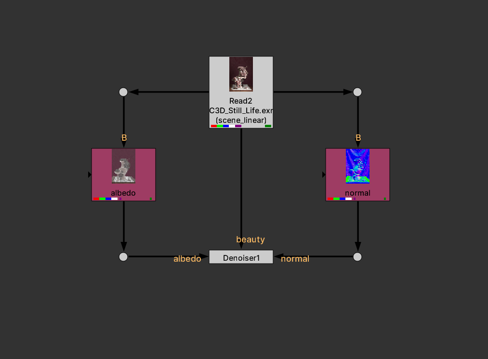
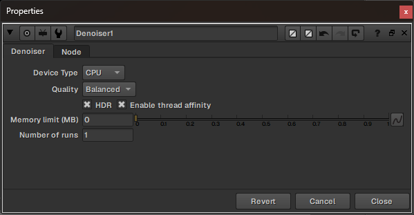

# Nuke Denoiser

A Nuke node plugin for denoising CG renders using [Intel Open Image Denoise (OIDN)](https://github.com/RenderKit/oidn).

Forked from [mateuszwojt/NukeCGDenoiser](https://github.com/mateuszwojt/NukeCGDenoiser) with significant Windows stability fixes and a self-contained distribution system.




---

## Requirements

- **Windows 10/11 x64** (this fork is Windows-only)
- **Nuke 16** (tested on 16.0v8; other recent versions likely work)
- No GPU required — CPU denoising only

---

## Install

### Option A — Double-click (recommended)

1. Download or clone this repository
2. Double-click `install.bat`
3. Restart Nuke

### Option B — Python

```
python install.py
```

The installer:

- Copies the plugin folder to `~/.nuke/nuke-denoiser/`
- Adds a `pluginAddPath` entry to `~/.nuke/init.py`
- Cleans up any old denoiser entries from previous installs
- Is idempotent — safe to run multiple times

### Uninstall

```
python uninstall.py
```

Removes the `init.py` entry and optionally deletes the plugin folder.

---

## Usage

1. In Nuke, go to **Nodes > MW > Denoiser** (or Tab-search `Denoiser`)
2. Connect inputs:

| Input | Content | Required |
|-------|---------|----------|
| 0 — beauty | RGB beauty pass | Yes |
| 1 — albedo | Albedo AOV (RGB) | No |
| 2 — normal | Normal AOV (RGB) | No |

3. If your EXR has all AOVs in a single stream, use **Shuffle** nodes to extract albedo and normal into separate RGB streams before connecting
4. Choose quality and render



### Knobs

| Knob | Description |
|------|-------------|
| Device Type | CPU (only stable option — see limitations) |
| Quality | **Balanced** (default) or **High** |
| HDR | Enable for high-dynamic-range input (recommended) |
| Enable thread affinity | Pins OIDN threads to hardware threads for performance |
| Memory limit (MB) | Cap OIDN memory usage; 0 = no limit |
| Number of runs | Feed the image through the filter N times |

---

## Building from source

Requires [Visual Studio 2022](https://visualstudio.microsoft.com/) and [CMake 3.10+](https://cmake.org/). **MinGW/GCC cannot be used** — Nuke ships MSVC import libraries (`.lib` files) and GCC cannot link against them.

```bat
cd nuke-denoiser
cmake -B build -G "Visual Studio 17 2022" -DOIDN_ROOT="c:/bin/oidn-2.1.0"
cmake --build build --config Release
copy build\lib\Release\Denoiser.dll denoiser.dll
```

The output `denoiser.dll` should be placed at the repo root (or in your `~/.nuke/nuke-denoiser/` install).

**OIDN path:** Replace `c:/bin/oidn-2.1.0` with wherever you extracted the [OIDN 2.1.0 release](https://github.com/RenderKit/oidn/releases/tag/v2.1.0). **Do not use a newer OIDN version** — see the TBB compatibility note above.

**Nuke path:** The CMake config auto-detects Nuke from standard install locations. If detection fails, set `-DNUKE_ROOT="C:/Program Files/Nuke16.0v8"`.

---

## What's different from the original

The original plugin could freeze or crash the host machine when used with animation sequences or multiple concurrent frames. This fork fixes that and adds a proper Windows distribution.

**Stability fixes (C++):**
- Global OIDN device shared across all node instances — eliminates per-instance construction/destruction races during multi-threaded Nuke renders
- `CRITICAL_SECTION` instead of `std::mutex` for thread synchronization — `std::mutex` global constructors don't reliably run when a DLL is loaded via `LoadLibrary` inside Nuke, causing segfaults on lock
- `DllMain` initializes the critical section on `DLL_PROCESS_ATTACH`, guaranteed to run before any plugin callbacks
- OIDN DLL search path resolved relative to the plugin DLL at load time (`GetModuleFileNameW`) — no hardcoded install paths

**Distribution:**
- All OIDN 2.1.0 runtime DLLs bundled in `oidn-cpu-only/bin/` — no separate OIDN installation needed
- `install.py` / `install.bat` — one-click installer that copies the plugin and patches `~/.nuke/init.py`
- `uninstall.py` — clean removal

**Why OIDN 2.1.0 and not newer:**
OIDN 2.4.x ships with `tbb12.dll` v2022.3, which conflicts with Nuke's own `tbb.dll` v2020.3 when both are in the same process, causing immediate crashes. OIDN 2.1.0's `tbb12.dll` (v2021.10) is compatible with Nuke's TBB version.

---

## Known limitations

- **GPU denoising is disabled.** The CUDA/HIP/SYCL device types appear in the knob but are untested and likely conflict with Nuke's GPU context. Use CPU only.
- **Windows only.** The original plugin supports Linux and macOS; this fork's distribution system is Windows-specific. The C++ source itself is cross-platform.
- **RGB only.** Alpha is not processed and passes through unchanged.
- **Inputs must match resolution.** If beauty, albedo, and normal are different sizes, reformat them to match before connecting.

---

## Acknowledgements

Based on [NukeCGDenoiser](https://github.com/mateuszwojt/NukeCGDenoiser) by [Mateusz Wojt](https://github.com/mateuszwojt), licensed under the original project's license (see `LICENSE`).

Uses [Intel Open Image Denoise](https://github.com/RenderKit/oidn), © Intel Corporation.