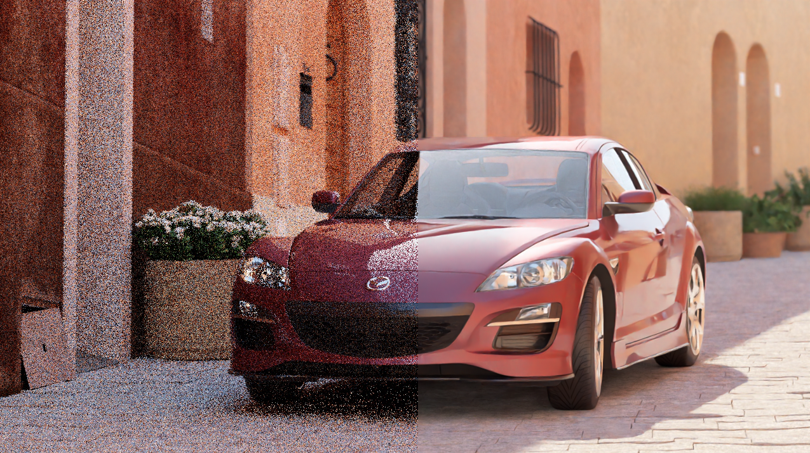

# Nuke Denoiser

A Nuke node plugin for denoising CG renders using [Intel Open Image Denoise (OIDN)](https://github.com/RenderKit/oidn).

Bundles a one-click install script.

Forked from [mateuszwojt/NukeCGDenoiser](https://github.com/mateuszwojt/NukeCGDenoiser) with significant Windows stability fixes and quality-of-life improvements.

## 

## Requirements

- **Windows 10/11 x64** (this fork is Windows-only)
- **Nuke 16** (tested on 16.0v8; other recent versions likely work)
- **CUDA** drivers for Nvidia GPUs (**Optional**, defaults to CPU denoising)

---

## Install

Make sure **Nuke is closed** before proceeding with the install.

### Option A — Straightforward (recommended)

Copy paste this command in a **Windows Command Prompt** _(cmd.exe)_

```
cd Downloads
git clone https://github.com/JTCHE/NukeCGDenoiser
cd NukeCGDenoiser
install.bat
```

### Option B — Double-click

1. Clone this repository
2. Double-click `install.bat`
3. Restart Nuke
4. Delete this folder

### Option C — Python

```
python install.py
```

### What it does

The installer:

- Copies the plugin folder to `~/.nuke/nuke-denoiser/`
- Adds a `pluginAddPath` entry to `~/.nuke/init.py`
- Cleans up any old denoiser entries from previous installs
- Is safe to run multiple times _(idempotent)_

### Uninstall

```
python uninstall.py
```

Removes the `init.py` entry and optionally deletes the plugin folder.

---

## Usage

1. In Nuke, Tab-search **`Denoiser`** _(or go to Nodes > MW > Denoiser)_
2. Connect your render and choose a workflow:

### Workflow A — Multi-layer EXR (recommended)

Place the Denoiser directly on a multi-layer EXR Read node. Use the **layer picker knobs** to select which passes to use:

- **Beauty layer** — the layer to denoise (default: `rgb`). The denoised result is written to the `rgb` channels; the original layer is left untouched.
- **Albedo layer** — albedo or diffuse pass for auxiliary-guided denoising. Set to `none` to skip.
- **Normal layer** — world-space normals for auxiliary-guided denoising. Set to `none` to skip. Must be accompanied by Albedo layer.

All other layers pass through unchanged, so the node works like a Shuffle + Denoise in one step.

### Workflow B — Separate inputs


Connect separate images to each input:

| Input      | Content           | Required |
| ---------- | ----------------- | -------- |
| 0 - Beauty | Beauty pass (RGB) | ✅       |
| 1 - Albedo | Albedo AOV (RGB)  | ❌       |
| 2 - Normal | Normal AOV (RGB)  | ❌       |

When albedo or normal inputs are connected, the corresponding layer picker knobs are disabled — the node reads `RGB` directly from the connected input. This is useful for split EXRs, PNGs, or renders that output each AOV as a separate file.

### Alpha denoising

Enable the alpha checkbox (A) in the **Beauty layer** knob to also denoise the alpha channel. Alpha is denoised in a separate pass since OIDN processes 3 channels at a time.

### Properties

| Knob                           | Description                                                                                                                            |
| ------------------------------ | -------------------------------------------------------------------------------------------------------------------------------------- |
| Device Type                    | **CPU** (default) or **CUDA**                                                                                                          |
| Quality                        | **Balanced** (default) or **High**                                                                                                     |
| HDR                            | Enable for high-dynamic-range input (recommended)                                                                                      |
| Enable thread affinity         | Pins OIDN threads to hardware threads for performance                                                                                  |
| Memory limit (MB)              | Cap OIDN memory usage; 0 = no limit                                                                                                    |
| Number of runs                 | Feed the image through the filter N times                                                                                              |
| Beauty / Albedo / Normal layer | Select which layer from the input EXR to use for each role. Albedo and Normal are disabled when their inputs are connected             |
| Prefilter Auxiliary Passes     | Tells OIDN to prefilter noisy albedo/normal before using them for guidance. Leave unchecked if your auxiliary passes are already clean |

---

## Building from source

Requires [Visual Studio 2022](https://visualstudio.microsoft.com/) and [CMake 3.10+](https://cmake.org/). **MinGW/GCC cannot be used** — Nuke ships MSVC import libraries (`.lib` files) and GCC cannot link against them.

```bat
cd nuke-denoiser
cmake -B build -G "Visual Studio 17 2022" -DOIDN_ROOT="c:/bin/oidn-2.1.0"
cmake --build build --config Release
copy build\lib\Release\Denoiser.dll denoiser.dll
```

The output `denoiser.dll` should be placed at the repo root (or in your `~/.nuke/nuke-denoiser/` install).

**OIDN path:** Replace `c:/bin/oidn-2.1.0` with wherever you extracted the [OIDN 2.1.0 release](https://github.com/RenderKit/oidn/releases/tag/v2.1.0). **Do not use a newer OIDN version** — see the TBB compatibility note above.

**Nuke path:** The CMake config auto-detects Nuke from standard install locations. If detection fails, set `-DNUKE_ROOT="C:/Program Files/Nuke16.0v8"`.

---

## What's different from the original

The original plugin could freeze or crash the host machine when used with animation sequences or multiple concurrent frames. This fork fixes that and adds a proper Windows distribution.

**Stability fixes (C++):**

- Global OIDN device shared across all node instances — eliminates per-instance construction/destruction races during multi-threaded Nuke renders
- `CRITICAL_SECTION` instead of `std::mutex` for thread synchronization — `std::mutex` global constructors don't reliably run when a DLL is loaded via `LoadLibrary` inside Nuke, causing segfaults on lock
- `DllMain` initializes the critical section on `DLL_PROCESS_ATTACH`, guaranteed to run before any plugin callbacks
- OIDN DLL search path resolved relative to the plugin DLL at load time (`GetModuleFileNameW`) — no hardcoded install paths

**Distribution:**

- OIDN 2.1.0 CPU runtime DLLs bundled in `oidn/bin/` — no separate OIDN installation needed
- CUDA device DLL (`OpenImageDenoise_device_cuda.dll`) not bundled due to size; drop it in `oidn/bin/` to enable GPU denoising
- `install.py` / `install.bat` — one-click installer that copies the plugin and patches `~/.nuke/init.py`
- `uninstall.py` — clean removal

**Why OIDN 2.1.0 and not newer:**
OIDN 2.4.x ships with `tbb12.dll` v2022.3, which conflicts with Nuke's own `tbb.dll` v2020.3 when both are in the same process, causing immediate crashes. OIDN 2.1.0's `tbb12.dll` (v2021.10) is compatible with Nuke's TBB version.

---

## Known limitations

- **CUDA denoising is experimental.** Requires an NVIDIA GPU and driver 522.06+. Drop `OpenImageDenoise_device_cuda.dll` from the [OIDN 2.1.0 release](https://github.com/RenderKit/oidn/releases/tag/v2.1.0) into `oidn/bin/` to enable it. HIP and SYCL are not supported.
- **Windows only.** The original plugin supports Linux and macOS; this fork's distribution system is Windows-specific. The C++ source itself is cross-platform.
- **Inputs must match resolution.** If beauty, albedo, and normal are different sizes, reformat them to match before connecting.

---

## Acknowledgements

Based on [NukeCGDenoiser](https://github.com/mateuszwojt/NukeCGDenoiser) by [Mateusz Wojt](https://github.com/mateuszwojt), licensed under the original project's license (see `LICENSE`).

Uses [Intel Open Image Denoise](https://github.com/RenderKit/oidn), © Intel Corporation.
